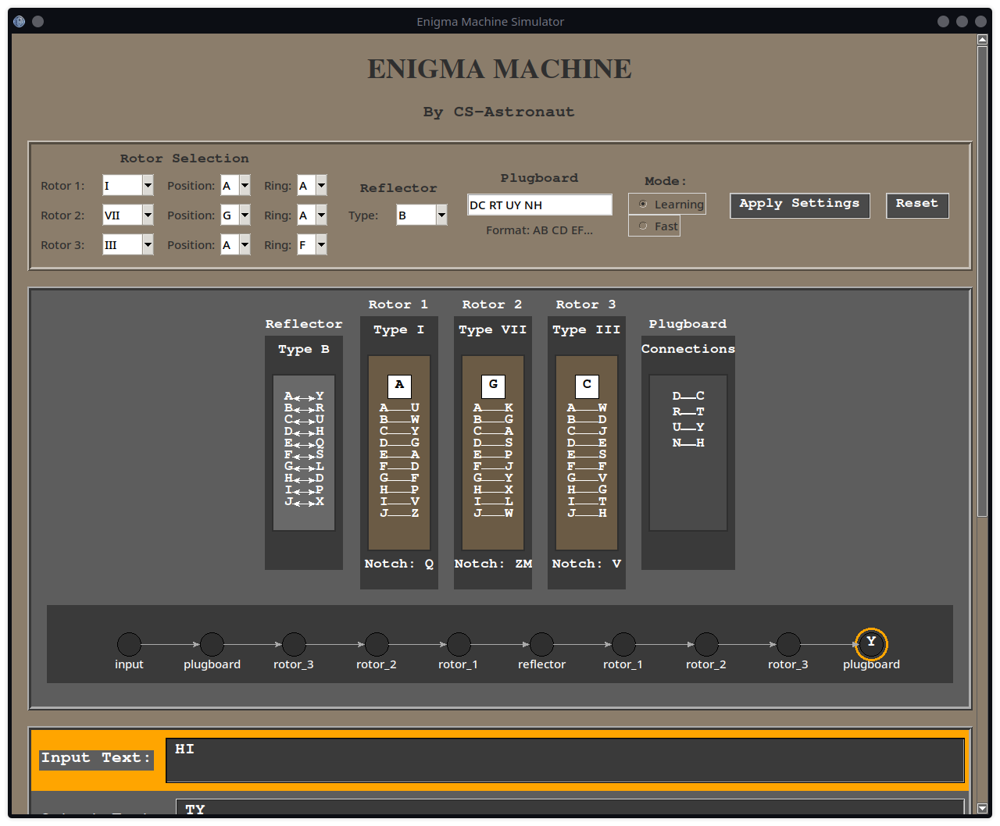
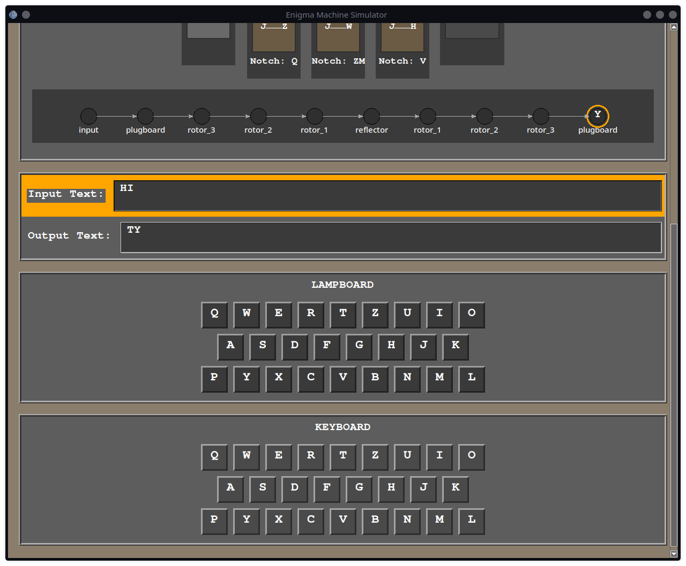

# Enigma Machine Simulator 🔐

## Overview
The Enigma Machine Simulator is a Python-based graphical application that replicates the functionality of the historical Enigma encryption device. It allows users to configure rotors, reflectors, and plugboard settings to encrypt and decrypt messages, providing an interactive learning experience.

## Features ✨
- **🔄 Rotor Configuration**: Choose from multiple historical Enigma rotors.
- **🔍 Reflector Selection**: Select different reflector types.
- **🔌 Plugboard Customization**: Add custom plugboard connections.
- **🖥 Graphical Interface**: Simulates the Enigma machine with visual representations of components.
- **🐢 Step-by-Step Encryption**: View the encryption path in learning mode.
- **⚡ Fast Mode**: Quickly encrypt messages without visual breakdown.

## Installation 🛠
### Prerequisites
- Python 3.x
- Required libraries: `tkinter`

### Setup
1. Clone this repository:
   ```sh
   git clone https://github.com/CS-Astronaut/Enigma-Machine.git
   cd Enigma-Machine
   ```
2. Run the application:
   ```sh
   python main.py
   ```

## Usage 🚀
1. Launch the application.
2. Configure rotors, reflectors, and plugboard settings.
3. Enter text in the input field to see the encrypted output.
4. Observe the encryption path in learning mode.
5. Reset or modify settings as needed.

## Screenshots 🖼
### Main Interface


### Encryption in Progress



## License 📜
This project is licensed under the MIT License. Feel free to modify and use it.

